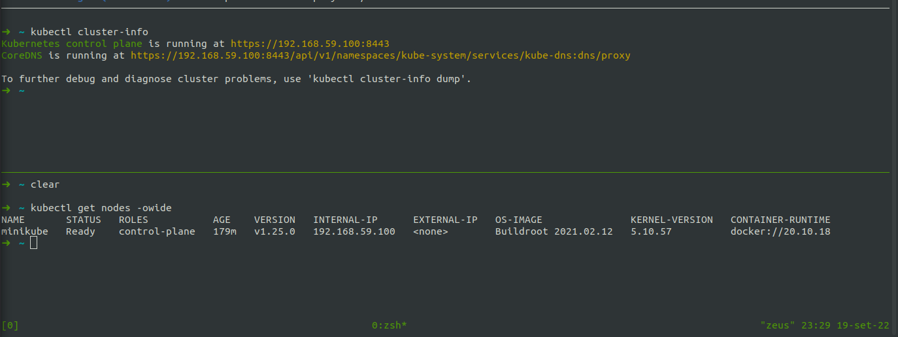
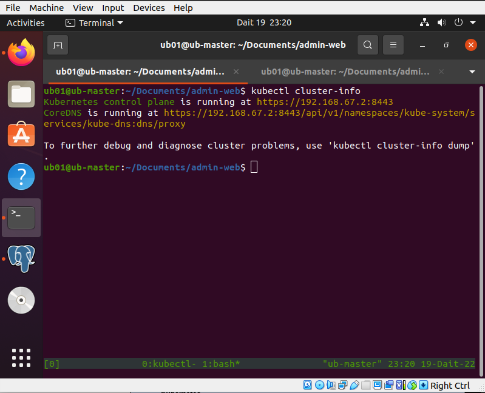
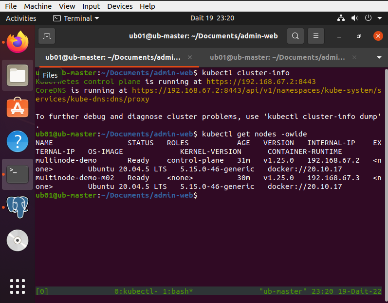
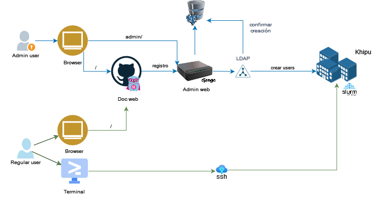
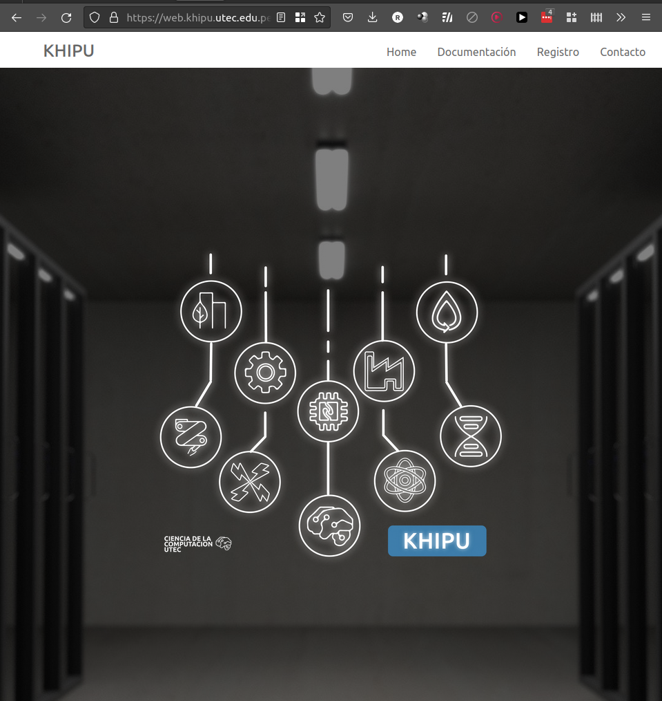
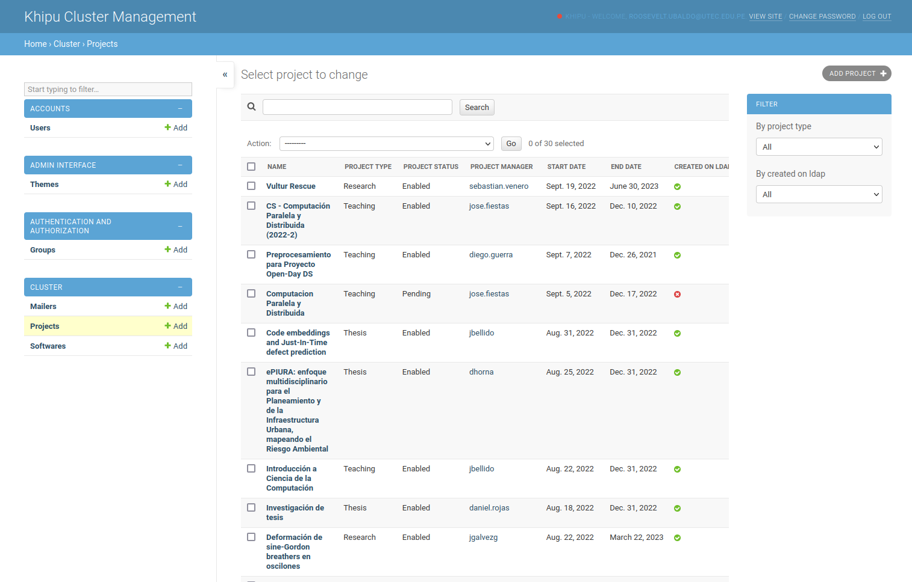
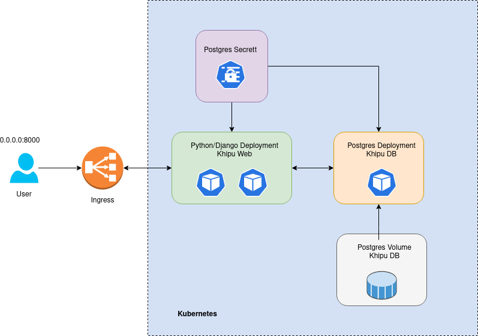

# Tarea 2: Deploying Kubernetes

```bash
# Download MiniKube 
curl -LO https://storage.googleapis.com/minikube/releases/latest/minikube-linux-amd64
sudo install minikube-linux-amd64 /usr/local/bin/minikube

# Install kubectl 
curl -LO "https://dl.k8s.io/release/$(curl -L -s https://dl.k8s.io/release/stable.txt)/bin/linux/amd64/kubectl"
curl -LO "https://dl.k8s.io/$(curl -L -s https://dl.k8s.io/release/stable.txt)/bin/linux/amd64/kubectl.sha256"
echo "$(cat kubectl.sha256)  kubectl" | sha256sum --check
sudo install -o root -g root -m 0755 kubectl /usr/local/bin/kubectl
```

## Deploying Kubernetes single and multi-node

1. Single node

```bash
minikube start
```



2. Multi node

```bash
minikube start --nodes 2 -p my-multinode
```




## Search and select a containerized application

Khipu es el cluster HPC de UTEC. Sus usuarios van en aumento cada vez más y por ello se necesitaba una web que facilite la creación y gestión de usuarios. Para ello se creó la web de Khipu empleando Django como framework principal y postgresql como backend.



La web basicamente poseen un landing page, un pagina de registro y un portal de administración. Cuando un usuario registra un proyecto, su solicitud llega al portal de administración. Una vez aprobado se comunica con el gestor de directorios LDAP en Khipu para proceder con la creación de su cuenta. Luego se envia desde el portal de administrador un mail con las credenciales del usuario.




- Código fuente: [https://github.com/khipu-utec/admin-web](https://github.com/khipu-utec/admin-web)
- Web en producción: [https://web.khipu.utec.edu.pe](https://web.khipu.utec.edu.pe)

- Readme de la aplicación: [readme](./parte-2.md)

## Deployment a containerized application on kubernetes

Se crearon dos deployments, uno para django y otro para postgres. Las variables de ambiente de postgres y django se encuentran en un secret. Para que la data de la db no se pierda se creó un volumen. Finalmente, para tener salida al exterior se configuró un ingress.




Los `.yaml` empleados se encuentran en la siguiente [carpeta](./deploy/).

1. Single node

```bash
minikube start

git clone https://github.com/khipu-utec/admin-web.git
cd admin-web/deploy

## Create postgres pod
kubectl apply -f postgres/postgres-credentials.yaml  
kubectl apply -f postgres/postgres-storage.yaml
kubectl apply -f postgres/python.yaml

## Postgres port-forward
kubectl port-forward svc/postgres 5432:5432

## Create django pod
kubectl apply -f python/python-django-secret-key.yaml  
kubectl apply -f python/python-ingress.yaml
kubectl apply -f python/python.yaml

## Create django pod
kubectl port-forward deployment/tickets 8000:8000

```

2. Multi node

```bash
minikube start --nodes 2 -p my-multinode


git clone https://github.com/khipu-utec/admin-web.git
cd admin-web/deploy

## Create postgres pod
kubectl apply -f postgres/postgres-credentials.yaml  
kubectl apply -f postgres/postgres-storage.yaml
kubectl apply -f postgres/python.yaml

## Postgres port-forward
kubectl port-forward svc/postgres 5432:5432

## Create django pod
kubectl apply -f python/python-django-secret-key.yaml  
kubectl apply -f python/python-ingress.yaml
kubectl apply -f python/python.yaml

## Create django pod
kubectl port-forward deployment/tickets 8000:8000

```

---


